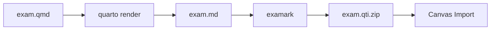

# Quarto Exam Extension

Examark includes a powerful Quarto extension that allows you to author exams in Quarto (`.qmd`) and export them to multiple formats, including Canvas-ready QTI, HTML previews, printable PDFs, and more.

## Installation

### Method 1: GitHub Installation (Recommended)

Install directly from the GitHub repository:

```bash
quarto add Data-Wise/examark
```

This will:

1. Download the extension from GitHub
2. Create `_extensions/exam/` in your project
3. Prompt you to trust the extension

!!! tip "Pin to a Version"
    For reproducible builds, install a specific release:
    ```bash
    quarto add Data-Wise/examark@v0.6.1
    ```

### Method 2: Local Installation

If you have the repository cloned:

```bash
cp -r examark/_extensions/exam your-project/_extensions/
```

### Verify Installation

```bash
ls _extensions/exam/
# Should show: _extension.yml  exam-filter.lua  exam.scss  qti-post-render.js
```

## Quick Start

1. Create a `.qmd` file with the `exam-qti` format:

```yaml
---
title: "My Quiz"
format:
  exam-qti: default
---

## 1. What is 2 + 2?

a) 3
b) **4** [correct]
c) 5
```

2. Render to Markdown:

```bash
quarto render quiz.qmd --to exam-qti
```

3. Convert to Canvas QTI:

```bash
examark quiz.md -o quiz.qti.zip
```

!!! note "LaTeX Math Works Automatically"
    The `exam-qti` format preserves `$...$` and `$$...$$` math notation by default. No extra configuration needed!

## Available Formats

| Format | Best For | Output |
|--------|----------|--------|
| `exam-qti` | LMS import (Canvas, Blackboard, Moodle) | Markdown → QTI |
| `exam-html` | Browser preview | Interactive HTML |
| `exam-pdf` | Printable exams | PDF (student version) |
| `exam-pdf-solutions` | Answer keys | PDF (with solutions) |
| `exam-docx` | Word editing | Microsoft Word |
| `exam-odt` | LibreOffice/Google | OpenDocument |
| `exam-typst` | Modern PDF | Typst PDF |

!!! tip "Backward Compatibility"
    `exam-gfm` still works as an alias for `exam-qti`.

### Multi-Format Rendering

Render to multiple formats simultaneously:

```yaml
format:
  exam-qti: default      # For LMS import
  exam-pdf: default      # For printing
  exam-html: default     # For preview
```

```bash
quarto render exam.qmd  # Renders all formats
```

## Configuration Options

### Basic Configuration

```yaml
---
title: "Statistics Midterm"
format:
  exam-qti: default      # LaTeX math enabled by default

exam:
  solutions: false       # Hide solution blocks
  default-points: 2      # Default points per question
  include-answers: true  # Include answer markers (for QTI)
---
```

### Full Configuration Reference

```yaml
exam:
  # Content options
  solutions: false           # Show/hide solution blocks
  default-points: 2          # Default points when not specified
  include-answers: true      # Include [correct] markers in output
  shuffle-answers: false     # Randomize answer order (HTML only)
  grading-table: true        # Show grading table (PDF)
  
  # Typography (PDF/HTML)
  fonts:
    size: 11pt
    section-size: 1.2em
    question-title-size: 1em
    question-title-weight: 600
    question-desc-size: 1em
    question-desc-weight: 400
  
  # Answer space (PDF only)
  answer-space:
    multiple-choice: 0cm
    true-false: 0cm
    short-answer: 2cm
    numeric: 1.5cm
    essay: 5cm
    fill-blank: 1cm
  
  # Headers/Footers (PDF only)
  header:
    left: "{{course.number}}"
    right: "Name: _______"
  footer:
    center: "Page {{page}} of {{pages}}"
```

## Question Syntax

### Multiple Choice

```markdown
## 1. Question text [2 pts]

a) Wrong answer
b) **Correct answer** [correct]
c) Wrong answer
d) Wrong answer
```

### True/False

```markdown
## 2. [TF] The Earth is round. → True

## 3. [TF] Water boils at 50°C. → False
```

### Multiple Answers

```markdown
## 4. [MultiAns, 4pts] Select all prime numbers.

*a) 2
b) 4
*c) 5
*d) 7
e) 9
```

### Short Answer

```markdown
## 5. [Short] The capital of France is

Answer: Paris
```

### Numeric

```markdown
## 6. [Numeric, 3pts] Calculate 15 × 4

Answer: 60 ± 0
```

### Essay

```markdown
## 7. [Essay, 10pts] Explain your reasoning.

Provide a detailed explanation of your thought process.
```

## Solution Blocks

Wrap solutions in a div with the `.solution` class:

```markdown
## 1. What is 2 + 2?

a) 3
b) **4** [correct]
c) 5

::: {.solution}
**Explanation:** 2 + 2 = 4 by basic arithmetic.
:::
```

**Behavior by format:**

| Format | Solutions Visible |
|--------|-------------------|
| `exam-qti` | Hidden |
| `exam-pdf` | Hidden |
| `exam-pdf-solutions` | Visible |
| `exam-html` | Hidden (default) |

To show solutions in any format, set `exam.solutions: true`.

## Canvas Workflow

### Standard Workflow



### Automatic QTI Generation

Enable auto-export in your YAML:

```yaml
format:
  exam-qti:
    qti-export: true
```

Now `quarto render` automatically creates the QTI zip:

```bash
quarto render exam.qmd --to exam-qti
# Creates: exam.md AND exam.qti.zip
```

## LaTeX Math

The extension preserves LaTeX math for Canvas:

```markdown
## 1. Which formula represents variance?

a) $\mu = \bar{x}$
b) $s^2 = \frac{\sum(x_i - \bar{x})^2}{n-1}$ [correct]
c) $\sigma = \sqrt{\sigma^2}$
```

!!! tip "Math is enabled by default"
    The `exam-qti` format includes `+tex_math_dollars` automatically. No extra configuration needed!

## Images and Figures

Images are automatically bundled in the QTI package:

```markdown
## 1. What does this graph show?


a) Normal distribution [correct]
b) Uniform distribution
c) Bimodal distribution
```

For R-generated figures:

````markdown
```{r}
#| echo: false
#| fig-cap: "Scatterplot"
plot(x, y)
```

## 1. Describe the relationship shown above.
````

## Templates

We provide several ready-to-use templates in `examples/`:

| Template | Use Case |
|----------|----------|
| `starter-exam.qmd` | Minimal starter for beginners |
| `canvas-export.qmd` | Canvas-focused with all question types |
| `dynamic-questions.qmd` | R code for randomization |
| `template.qmd` | Complete reference with PDF styling |
| `template-solutions.qmd` | Answer key version |

## Troubleshooting

### Solutions appear in student version

Ensure `exam.solutions: false` is set:

```yaml
exam:
  solutions: false
```

### Math not rendering in Canvas

1. Check you're using correct delimiters: `$...$` for inline, `$$...$$` for display
2. Enable the math variant: `variant: +tex_math_dollars`
3. Verify Canvas has MathJax enabled

### Images missing in Canvas

1. Use relative paths in Markdown
2. Ensure images exist at the specified path
3. Check the QTI package includes images: `unzip -l exam.qti.zip`

### QTI import fails

Run the emulator to diagnose:

```bash
examark emulate-canvas exam.qti.zip
```

For Canvas New Quizzes, use strict validation:

```bash
examark verify exam.qti.zip --strict
```

Common fixes:

- Ensure each question has exactly one correct answer (except MultiAns)
- Check for special characters in question text
- Verify answer markers are properly formatted
